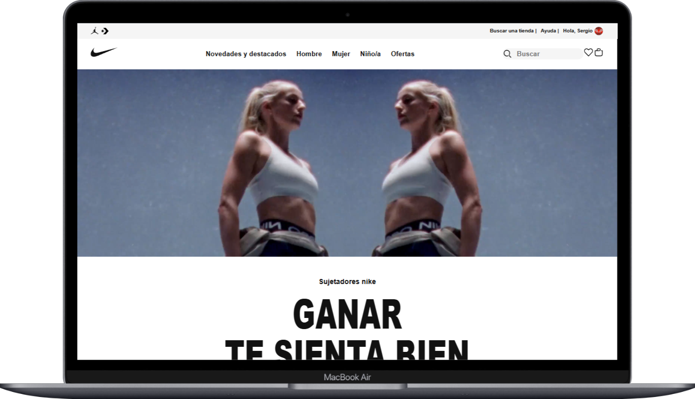
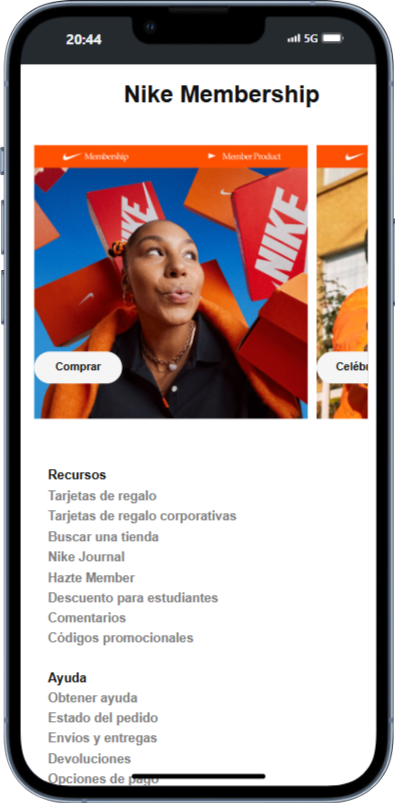

# 👟 Réplica de la Página de Nike

Este proyecto es una réplica visual del sitio web oficial de **Nike**, desarrollada con fines educativos y para practicar habilidades de maquetación, diseño responsive y uso de recursos multimedia.




## 📁 Estructura del Proyecto

- `index.html`: Página principal de la réplica.
- `styles.css`: Hoja de estilos con diseño responsivo.
- `assets/`: Carpeta con imágenes, logos y otros recursos visuales.

## 🛠 Tecnologías Usadas

- HTML5
- CSS3


## ✨ Características
- Diseño responsivo adaptado a móviles, tablets y escritorio.
- Menú de navegación y secciones visuales inspiradas en Nike.
- Uso de imágenes reales para reforzar el aspecto profesional.

## 🚀 Cómo usar este proyecto

Puedes clonar el repositorio:

```bash
git clone https://github.com/serxa92/Nike_landing.git

